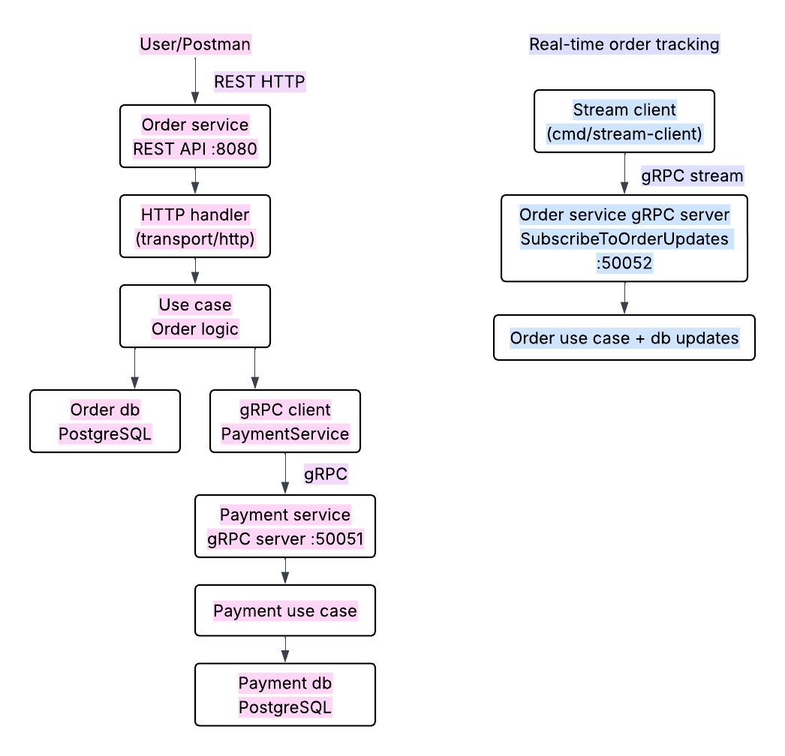
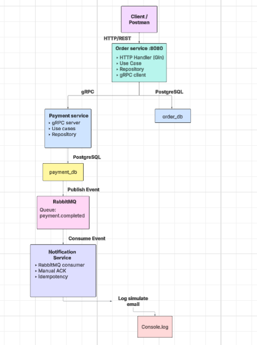

## Assignment 2 – gRPC migration & contract-first development

Name: Gulzada Issa  
Course: Advanced Programming 2  
Assignment: Assignment 2 – gRPC migration & contract-first development

## Project overview

This project is a migration of Assignment 1 from REST-based inter-service communication to gRPC-based communication.

The system contains two microservices:

**Order service**   
**Payment service**

The external API for end users is still REST and is exposed by the Order Service.  
However, the internal communication between Order Service and Payment Service was migrated from REST to gRPC.

In addition, the Order Service provides a **server-side streaming gRPC endpoint** for order tracking. A separate client can subscribe to order updates and receive status changes in real time.

## Main goal of the migration

In Assignment 1, the Order Service called the Payment Service using REST.  
In Assignment 2, this internal call was replaced with gRPC in order to introduce stronger contracts, typed messages, and a contract-first workflow using Protocol Buffers.

The business logic and domain structure from Assignment 1 were preserved.  
Only the communication and delivery layers were updated to support gRPC.

## Contract-first workflow

This project follows a contract-first approach.

Proto Repository:    
The `.proto` files are stored in a separate repository:

**AP2_protos**  
`https://github.com/guulzadaa/AP2_protos`

Generated Code Repository:   
The generated protobuf and gRPC files are stored in another separate repository:

**AP2_generated**  
`https://github.com/guulzadaa/AP2_generated`

The services import the generated Go code from the generated repository instead of keeping shared contract files inside the service source code.

This approach makes the service contract explicit and reusable.

## Architecture

The system follows Clean Architecture principles inside each service.

### Order service
The Order Service is responsible for:
- creating orders
- storing order data
- returning order details
- cancelling pending orders
- subscribing clients to order status updates

### Payment service
The Payment Service is responsible for:
- processing payment requests
- validating the payment amount
- storing payment records
- returning payment status

### Communication model
- User -> Order Service = REST
- Order Service -> Payment Service = gRPC
- Streaming Client -> Order Service = gRPC server-side streaming

### Database ownership
Each service has its own database:
- Order Service -> `order_db`
- Payment Service -> `payment_db`

This design avoids shared storage and keeps the bounded contexts independent.

## Architecture diagram


## Project structure
**Order service**
```
order-service/
├── cmd/
│   ├── order-service/
│   │   └── main.go
│   └── stream-client/
│       └── main.go
├── internal/
│   ├── domain/
│   ├── repository/
│   ├── transport/
│   │   ├── http/
│   │   └── grpc/
│   └── usecase/
├── migrations/
└── go.mod
```

**Payment service**
```
payment-service/
├── cmd/
│   └── payment-service/
│       └── main.go
├── internal/
│   ├── domain/
│   ├── repository/
│   ├── transport/
│   │   ├── http/
│   │   └── grpc/
│   └── usecase/
├── migrations/
└── go.mod
```


# Assignment 3 - Event-Driven Architecture

## Architecture
Order Service → Payment Service → RabbitMQ → Notification Service

## Features
- Event-driven communication using RabbitMQ
- Payment Service as Producer
- Notification Service as Consumer
- Manual ACK (at-least-once delivery)
- Durable queues and persistent messages
- Idempotency using event_id
- Dead Letter Queue (DLQ) with retry mechanism

## How to run
```bash
docker compose up --build
```

## Testing
- POST /orders -> triggers payment and event
- Notification Service logs email simulation
- RabbitMQ UI: http://localhost:15672

## Architecture diagram


